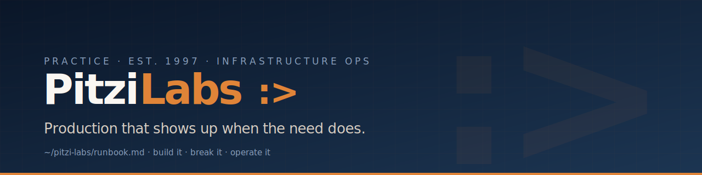

# PitziLabs

**Production that shows up when the need does.**
Twenty-five years of bare-metal data centers, 24×7 ops, and single-homed
environments — now bridging into cloud-native architecture by building it,
breaking it, and operating it.

 

### ☁️ &nbsp; Cloud & infrastructure

### 🏗️ &nbsp; Infrastructure as code

### 🔁 &nbsp; CI/CD & supply chain

### 📟 &nbsp; Observability & on-call

 

| What we do | |
| :-- | :-- |
| **Platform engineering** | Greenfield builds, Terraform-managed, observable from day one. |
| **Cost & posture audits** | One-page report, no theatre. |
| **Incident & on-call** | Runbooks and rotations humans can actually live with. |
| **CI/CD & supply chain** | OIDC, signed images, no long-lived credentials. |

<b>chris@pitzilabs.dev</b> &nbsp;·&nbsp; New England, US &nbsp;·&nbsp; remote · async-friendly

